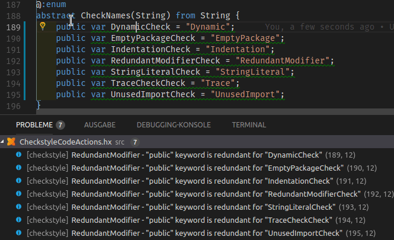

# VS Code extension for haxe-checkstyle

## Features

* Runs haxe-checkstyle when documents are opened or saved
* Display results as VS Code diagnostics
* Supports quickfixes for a small selection of checks
* Includes json schema definitions for both `checkstyle.json` and `checkstyle-excludes.json`

## Configuration

vscode-checkstyle accepts your regular haxe-checkstyle configuration files. It will first try to read `checkstyle.json` and `checkstyle-excludes.json` from your workspace folder (`checkstyle-excludes.json` is optional). If there is no `checkstyle.json` in your workspace folder, vscode-checkstyle tries to learn its location by reading key `haxecheckstyle.configurationFile` from your VSCode settings. Failing both vscode-checkstyle will use its own builtin default configuration which you can see in its project's root folder.

A second configuration key named `haxecheckstyle.sourceFolders` holds an array of folder names where checkstyle should run. It's the equivalent to passing `-s <foldername1> -s <foldername2>` to haxe-checkstyle. It defaults to `["src", "Source"]`.

## Quickfixes

You can apply quickfixes one at a time or by selecting a range including multiple checkstyle violations.

The following checks provide quickfixes:
- Dynamic
- EmptyPackage
- Indentation
- RedundantModifier
- StringLiteral
- Trace
- UnusedImport

## Json schema definitions

vscode-checkstyle comes with json schemas for `checkstyle.json` and `checkstyle-excludes.json`, which will help you through autocomplete and documentation when editing both file types. e.g.:

## TODO

* Check on all the workspace
* And more :)
